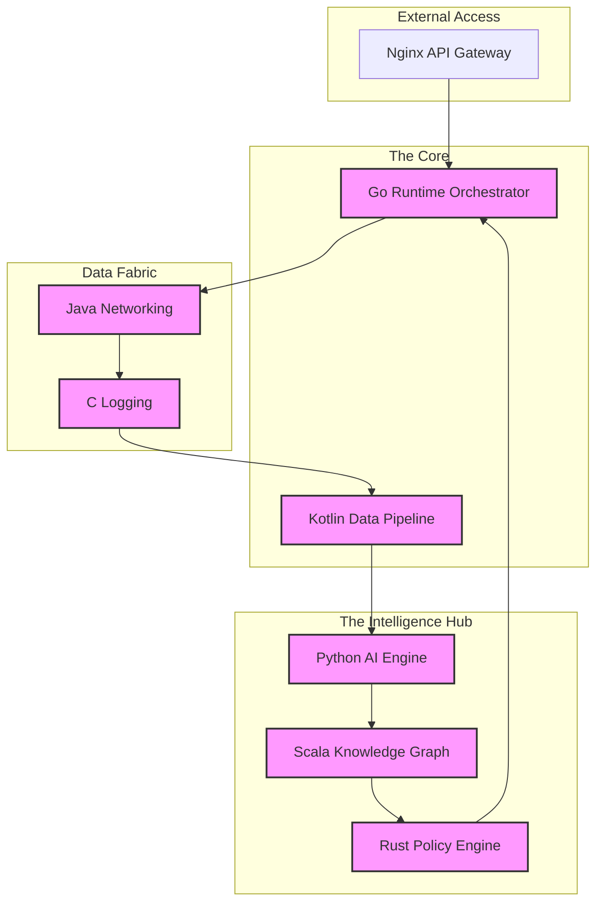

<div align="center">

# 🛡️ ExplainAI-Sentinel

### The Ultimate AI-Driven, Polyglot Zero-Trust Analytics Platform

[](https://github.com/your-username/ExplainAI-Sentinel)
[](https://github.com/your-username/ExplainAI-Sentinel)
[](LICENSE)

---

**ExplainAI-Sentinel** is a next-generation security ecosystem that harmonizes **9 programming languages** into a single, high-performance, and verifiable defense system. It combines state-of-the-art **Explainable AI (XAI)**, **Causal Reasoning**, and **Zero-Trust Enforcement** to protect microservices and edge-to-cloud environments with total transparency.

[**Explore Documentation**](docs/ARCHITECTURE.md) • [**View Setup Guide**](SETUP.md) • [**Try the Demo**](demo_sentinel.py)

---

</div>

## 🌌 The Polyglot Matrix

| Layer | Language | Core Responsibility |
| :--- | :---: | :--- |
| **Orchestration** |  | **Runtime & Service Registry**: The brain that coordinates all services. |
| **Intelligence** |  | **AI security Engine**: XAI-based anomaly detection & threat classification. |
| **Reasoning** |  | **Knowledge Graph**: Causal reasoning and temporal relationship analysis. |
| **Enforcement** |  | **Policy Engine**: High-performance Zero-Trust & Trust Scoring. |
| **Networking** |  | **Secure Messaging**: Netty-based, high-throughput mTLS communication. |
| **Data Ops** |  | **ETL Pipeline**: Kafka Streams based data enrichment and streaming. |
| **Performance** |  | **Logging Engine**: Ultra-fast, lock-free ring buffer for system metrics. |
| **UI/UX** |  | **Dashboard**: Real-time React visualization of security events. |
| **DevOps** |  | **Orchestration logic**: Infrastructure-as-code and cert automation. |

---

## 🛠️ Unified Architecture



---

## ✨ Enterprise Features

### 🤖 Explainable AI Security
Stop "Black Box" security. Sentinel uses **SHAP** and **LIME** to explain *why* an event was flagged, providing human-readable narratives and feature-importance plots for every alert.

### 🔐 Dynamic Zero-Trust
Continuous **Trust Scoring** assesses the health and behavior of every service in real-time. Compromised services are isolated automatically via high-performance Rust enforcement.

### 🔗 Causal Reasoning
Using **Do-Calculus** and temporal correlation, Sentinel doesn't just find symptoms; it traces the entire **Attack Path** across your distributed systems back to the root cause.

---

## 🚀 Deployment in 60 Seconds

### **Local (Docker)**
```bash
make up
# Run the demo integration
python demo_sentinel.py
```

### **Enterprise (Kubernetes)**
```bash
make deploy-helm
```

---

## 📊 Observability Stack
- **Prometheus**: Real-time metric scraping across all 9 polyglot tiers.
- **Grafana**: Pre-configured dashboards for global system health and AI confidence.
- **Jaeger**: Distributed tracing for cross-service causal chains.

---

## 📜 Professional Governance
- ✅ **[SECURITY.md](SECURITY.md)**: Industry-standard vulnerability reporting.
- ✅ **[CODEOWNERS](.github/CODEOWNERS)**: Automated PR routing for language specialists.
- ✅ **[Dependabot](.github/dependabot.yml)**: Continuous security auditing for all 9 language dependencies.

---

<div align="center">
  <sub>Made with ❤️ by Tushar<i>Securing the Future with Transparence.</i></sub>
</div>
